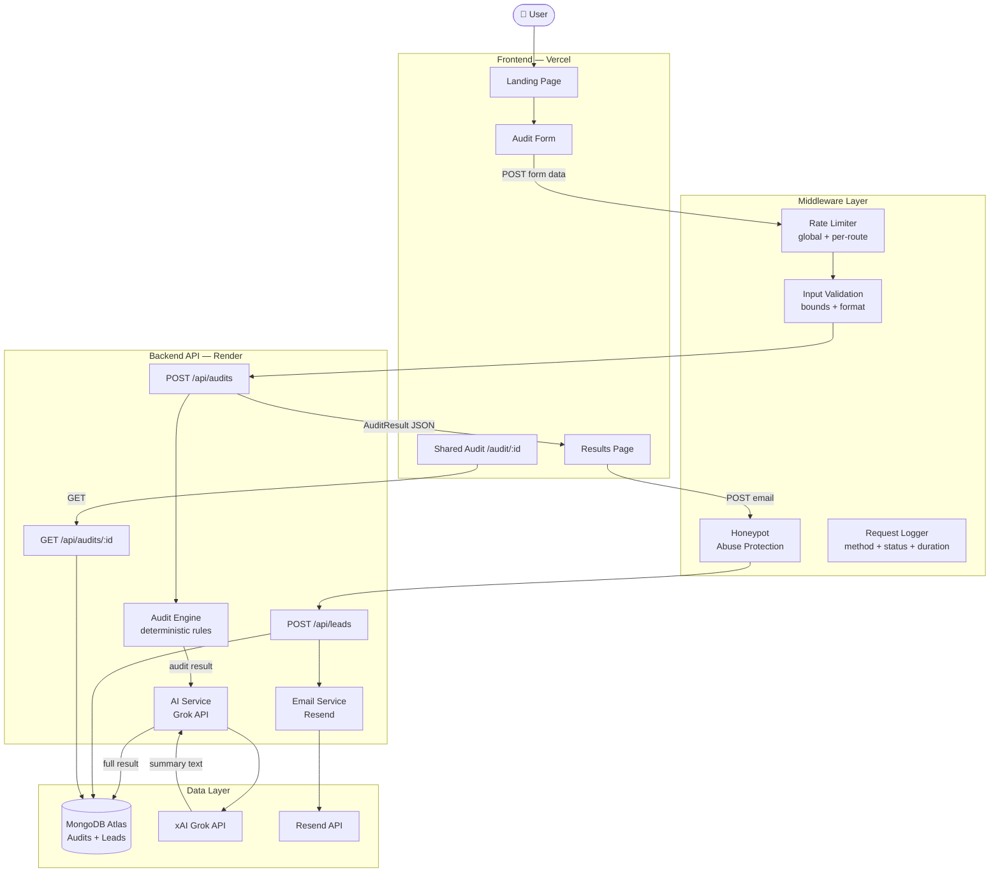

# Architecture — StackSave AI Audit

## System Diagram

## Data Flow: Input → Audit Result

1. **User fills the audit form** (AuditPage.tsx) — selects tools, enters plan/spend/seats, team size, use case. Form state auto-saved to `localStorage` on every change.

2. **Form submitted** → `POST /api/audits` with `AuditRequest` JSON body.

3. **Rate limiter** checks: max 20 audits/hour per IP. If exceeded → 429.

4. **Audit Engine** (`engine.ts`) runs all 7 rules against every tool entry:
   - `ruleOverpaidPlan` — team plan for ≤2 users
   - `ruleUnusedSeats` — seats > team size by >25%
   - `ruleOverlappingTools` — two tools in same category
   - `ruleCheaperAlternative` — cheaper tool fits use case
   - `ruleAnnualDiscount` — annual billing saves ≥15%
   - `ruleRetailVsCredits` — API spend >$200/mo
   - `ruleFreeAlternativeAvailable` — solo user on paid plan

5. **Engine calculates totals**: sum of all rule savings, capped at total spend. Marks `isAlreadyOptimal` (savings <$20), `isHighSavings` (savings >$500).

6. **AI Service** calls xAI Grok API with a structured prompt containing the real audit numbers. Generates ~100-word personalized summary. Falls back to a template if API fails.

7. **Audit saved to MongoDB** with a UUID `auditId`. Private fields (email, companyName) stored but excluded from the public GET endpoint.

8. **Response** returns full `AuditResult` to frontend. Browser navigates to `/results/:id`.

9. **Results page** displays savings hero, per-tool insight cards, AI summary, savings chart. Email modal auto-shows after 3 seconds.

10. **Lead capture**: `POST /api/leads` → honeypot check → MongoDB insert → Resend transactional email. Email failure doesn't block the response.

11. **Share URL**: `/audit/:id` loads the public-safe version (no email/companyName).

## Stack Justification

| Choice | Why |
|---|---|
| **React + TypeScript** | TypeScript is explicitly preferred in the assignment. Type safety catches bugs at compile time, and it signals engineering maturity to reviewers. |
| **Vite** | 10–100x faster dev server than CRA. HMR is near-instant. Industry standard in 2025. |
| **Tailwind CSS v4** | Utility-first enables rapid UI iteration without context-switching to CSS files. v4 with the Vite plugin is the modern setup. |
| **Express over Flask** | TypeScript on both layers means shared types, one language context, and better IDE support. Flask would've been Python-only with no type sharing. |
| **MongoDB Atlas** | Flexible schema fits audit JSON blobs well (insights vary per audit). Free tier has no cold-start. Assignment explicitly names it as an acceptable option. |
| **xAI Grok** | Free API tier, OpenAI-compatible (same SDK, just change `baseURL`). Performs well for 100-word structured summaries. |
| **Resend** | Best developer experience of the transactional email options. 3k free emails/month is plenty for an MVP. Simple API — one function call. |
| **Framer Motion** | Production-quality animations with minimal code. The results page needs to feel impressive — animated number reveals and card entrances achieve this. |

## Scaling to 10k Audits/Day

Current architecture handles ~100 audits/day comfortably. At 10k/day, the changes would be:

1. **AI summary becomes the bottleneck** — Move to async processing: return audit results immediately (synchronously), queue AI summary generation via Redis/BullMQ, push the summary to the frontend via WebSocket or polling. This keeps P50 latency <200ms even when Grok is slow.

2. **MongoDB connection pooling** — Add a connection pool manager (Mongoose handles this, just tune `maxPoolSize`). Consider moving to a dedicated Atlas cluster instead of the shared free tier.

3. **Rate limiting moves to Redis** — In-memory rate limiting (current: `express-rate-limit` with memory store) doesn't work across multiple Render instances. Switch to `rate-limit-redis` with an Upstash Redis connection.

4. **CDN for the frontend** — Vercel handles this automatically, but audit result pages at `/audit/:id` should be cached at the edge after first render (stale-while-revalidate since audits are immutable once created).

5. **Separate the public share route** — `/audit/:id` is read-heavy (every share link hit). Move to a separate read replica or a Cloudflare Worker that reads directly from a read-optimized MongoDB replica.

6. **Observability** — Add structured logging (Pino) + error tracking (Sentry) before scaling. You can't debug production issues without logs.
