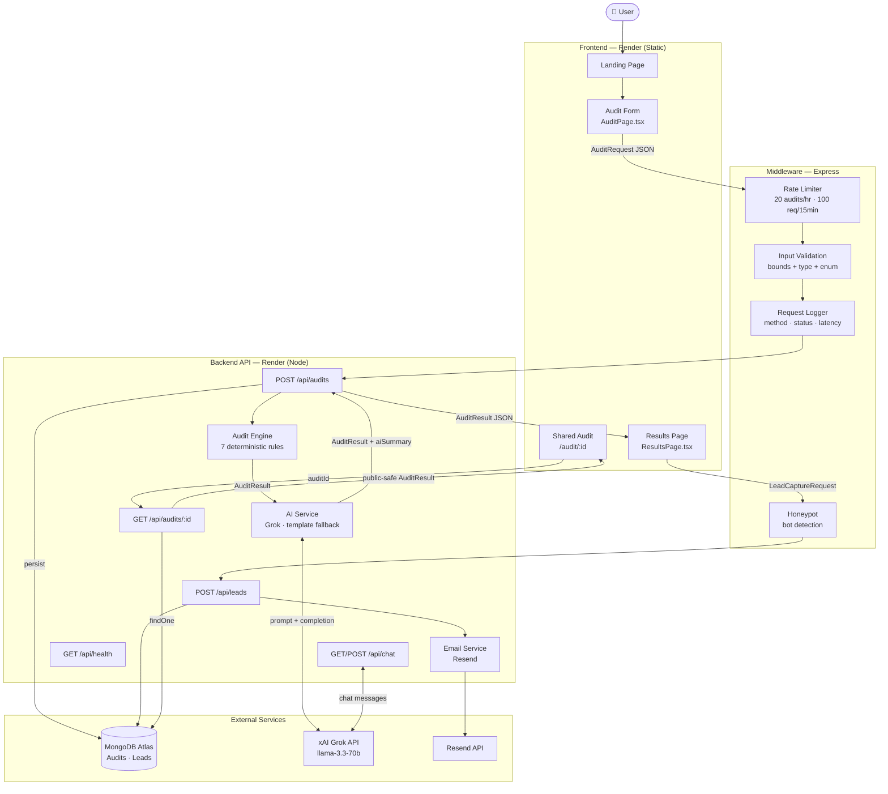

# Architecture — StackSave AI Audit

## System Diagram



## Data Flow: Form Submission → Audit Result

Understanding the request lifecycle is the clearest way to see where the architecture's tradeoffs live.

**1. Form state (client-side)**
`AuditPage.tsx` persists form state to `localStorage` on every change via `useLocalStorage`. No server round-trip until submit. Means a page reload loses nothing — the user picks up exactly where they left off.

**2. Submit → `POST /api/audits`**
The request body is a typed `AuditRequest`:
```typescript
{
  tools: ToolEntry[],  // 1–8 tools, each with toolId, plan, seats, monthlySpend, useCase
  teamSize: number,
  useCase: UseCase,
  companyName?: string
}
```

**3. Middleware chain (synchronous)**
- `globalLimiter` — 100 req / 15 min per IP
- `auditLimiter` — 20 audits / 1 hr per IP
- `validateAuditRequest` — checks every field: valid toolId enum, plan is string, spend 0–100k, seats 1–10k, no duplicate tools, team size 1–10k, valid use case enum

Any failure here returns a `400` with a specific error message. No audit runs.

**4. Audit engine (synchronous, deterministic)**
`engine.ts` iterates every `ToolEntry` and applies all 7 rules. Rules are pure functions — no I/O, no randomness, no LLM. Given the same input, they always produce the same output. This is intentional: the numbers in the report need to be finance-defensible.

Rule pipeline per tool:
```
ruleOverpaidPlan       → team plan for ≤2 seats
ruleUnusedSeats        → seats paid > team size by >25%
ruleOverlappingTools   → two tools in the same category
ruleCheaperAlternative → cheaper tool fits the use case, not already in stack
ruleAnnualDiscount     → annual billing saves ≥15% and ≥$5/mo
ruleRetailVsCredits    → API spend >$200/mo → consider credit resellers
ruleFreeAlternativeAvailable → solo user on paid plan that has a free tier
```

After all rules fire, insights are:
- **Deduplicated** — same `toolId + insightType`, keep the one with higher savings
- **Sorted** — `high` severity first, then by `potentialMonthlySaving` descending
- **Capped** — total savings cannot exceed total spend

**5. AI summary (async, fallible)**
The engine result (with real dollar figures) is passed to `aiService.ts`. A structured prompt asks Grok (`llama-3.3-70b-versatile`) for an 80–120 word personalized summary in second person. If the Grok API fails for any reason, `generateTemplateSummary` produces a deterministic fallback using the same numbers. The audit never fails because the AI did.

**6. Persist → MongoDB**
The complete `AuditResult` (including `aiSummary`) is saved with a UUID `auditId`. Private fields (`companyName`, `email`) are stored but stripped from the public GET endpoint. Audits are immutable once written — no update path exists.

**7. Response → Results page**
The full `AuditResult` is returned in the `201` response. The frontend navigates to `/results/:id`, passing the result via React Router `location.state` to avoid a redundant GET request on page load.

**8. Lead capture (async, non-blocking)**
The results page shows an email capture modal after 3 seconds. `POST /api/leads` passes through the honeypot check (bots fill the `_hp` field; humans don't), inserts the lead into MongoDB (composite unique index on `email + auditId` prevents duplicates), and fires a transactional Resend email. Email failure is caught and logged — it does not affect the lead save response.

**9. Share URL**
Every audit gets a `publicUrl` of `{FRONTEND_URL}/audit/{auditId}`. `GET /api/audits/:id` returns the same result with `companyName` and `email` omitted.

---

## Directory Structure

```
StackSave/
├── frontend/
│   ├── src/
│   │   ├── pages/          # AuditPage, ResultsPage, LandingPage, SharedAuditPage, NotFoundPage
│   │   ├── components/     # ChatBot (floating AI assistant)
│   │   ├── services/       # api.ts (Axios), pdfService.ts (jsPDF)
│   │   ├── hooks/          # useAudit, useLocalStorage
│   │   ├── data/           # tools.ts (frontend tool catalog + plan data)
│   │   ├── types/          # Shared TypeScript interfaces
│   │   └── utils/          # formatters.ts
│   └── server.js           # Express static server for Render deployment
│
├── backend/
│   └── src/
│       ├── audit-engine/   # catalog.ts, rules.ts, engine.ts — pure business logic
│       ├── routes/         # audit.ts, leads.ts, chat.ts, health.ts
│       ├── services/       # aiService.ts, dbService.ts, emailService.ts
│       ├── middleware/     # rateLimit.ts, validation.ts, honeypot.ts, logger.ts
│       └── types/          # index.ts — interfaces shared across backend
│
└── tests/
    └── audit-engine.test.ts  # 16 unit tests for engine + validation
```

The `audit-engine/` directory is the clearest architectural boundary: it has zero external dependencies (no Express, no Mongoose, no Axios). It could be extracted to an npm package and consumed by a different backend without changing a line.

---

## Stack Decisions

Every choice was made against a concrete alternative. Here's the actual reasoning:

| Choice | Alternative considered | Why this won |
|---|---|---|
| **React + TypeScript** | Vue, plain JS | TypeScript across both layers means the `AuditResult` type is defined once and used everywhere — frontend, backend, tests. Catches mismatches at compile time. |
| **Vite** | Create React App | Near-instant HMR. CRA is deprecated. No contest. |
| **Tailwind CSS v4** | CSS modules, styled-components | Utility-first is the right model for a dark-themed, component-dense UI built fast. v4 with the Vite plugin has better tree-shaking than v3. |
| **Express** | Fastify, Flask | TypeScript on both layers. Flask would have meant Python on the server and JavaScript on the client with no shared types. Fastify is faster but Express has a larger middleware ecosystem for this use case (helmet, express-rate-limit, express-validator). |
| **MongoDB Atlas** | Supabase/PostgreSQL | The `insights` array has variable shape depending on which rules fired (7 possible types, each with different fields). In Postgres this means either a JSON column (same as MongoDB), a wide nullable table (messy), or multiple joins for no query benefit. Audits are always read in full — there are no partial reads, aggregations, or cross-document joins. The document model is genuinely the right fit here, not just the convenient one. |
| **xAI Grok (llama-3.3-70b)** | OpenAI GPT-4o | Free API tier with no credit card. OpenAI-compatible — same SDK, just change `baseURL`. Performs well for structured 100-word summaries where the hard numbers are already supplied. If Grok ever degrades, switching to GPT-4o-mini is a one-line change. |
| **Resend** | SendGrid, Nodemailer/SMTP | SendGrid has a worse free tier and a slower API. Nodemailer requires managing SMTP credentials. Resend is one function call with a React-friendly template API. 3k emails/month free is more than enough for an MVP. |
| **jsPDF (client-side PDF)** | Puppeteer (server-side) | No server compute, no processing queue, no cold-start delay. The PDF generates in ~200ms in the browser. The tradeoff is that the PDF can't render the React UI — it's drawn with jsPDF primitives. Acceptable for MVP; Puppeteer would be the right call if PDF quality became a product priority. |
| **Framer Motion** | CSS transitions, React Spring | Production-quality stagger animations on the results page with minimal code. The animated savings counter (`$0 → $X`) is a high-impact moment that CSS transitions can't replicate cleanly. |

---

## What I'd Change at 10k Audits/Day

Current architecture handles ~100 audits/day comfortably on the free tier. The real bottlenecks at scale, in order of when they'd bite:

**1. AI summary blocks the response (hits first, ~500–1k audits/day)**

Right now `POST /api/audits` is synchronous end-to-end. The client waits for the Grok call before getting a response. Grok P95 latency is ~2–3 seconds — acceptable for an MVP, a problem at scale.

Fix: decouple. Return the audit result immediately (the deterministic engine is <10ms), queue the AI summary generation via BullMQ + Redis, push the summary to the client via a short-poll or WebSocket. The results page already shows a skeleton while loading — you'd just extend that pattern to cover async summary delivery.

**2. In-memory rate limiting breaks on multiple instances (hits at ~2k audits/day)**

`express-rate-limit` with the default memory store is per-process. The moment Render scales to 2 instances, rate limit state is not shared. A user could hit 20 audits/hour × number of instances.

Fix: `rate-limit-redis` with an Upstash Redis connection. One environment variable swap, one package install. The rate limit config stays identical.

**3. MongoDB free tier connection limits (~5k audits/day)**

MongoDB Atlas free tier (`M0`) has a 500-connection limit across all clients. At high request volume, connection pool exhaustion causes queuing and timeouts.

Fix: move to `M10` dedicated cluster (~$57/month), tune Mongoose `maxPoolSize` to match expected concurrency, add connection health monitoring.

**4. No observability means no debuggability (needed before scaling at all)**

The current logger is `method + path + status + duration` to stdout. That's enough for a demo, not for production.

Fix: structured JSON logging with Pino (same interface as `console.log`, 5x faster, machine-parseable), error tracking with Sentry (catches unhandled exceptions and slow transactions), and a `/api/metrics` endpoint exposing Prometheus-format counters for audit volume, AI success rate, and lead capture rate.

**5. Share URLs aren't cached (~8k audits/day)**

`GET /api/audits/:id` hits MongoDB on every request. Audit results are immutable once created — there's no reason to re-query the database for the same `auditId`.

Fix: add a Redis layer in front of the GET handler with a long TTL (audits don't change). Alternatively, deploy the share route as a Cloudflare Worker that caches at the edge. Either drops MongoDB read load by ~80% for popular shared audits.

---

## Architecture Principles

These were the explicit priorities while building — not abstract ideals, but constraints that shaped every real decision:

**Deterministic core, AI at the edges.** The audit engine produces the same output for the same input every time. No LLM touches the financial numbers. This was a hard constraint from the start: a CFO looking at a "save $340/month" figure needs to be able to trace that to a specific rule and a specific pricing source. AI generates the prose summary — where approximate language is fine — and nothing else.

**Fail gracefully, not loudly.** Every external dependency (Grok, Resend) has a fallback path. The AI service falls back to a template summary. Email failure is caught and logged without blocking the lead save. A user completing an audit never hits a 500 because a third-party API was slow.

**No infrastructure you don't need yet.** No Redis, no job queues, no WebSockets — not because these are bad ideas, but because at MVP scale they're complexity without benefit. The architecture is designed so these can be dropped in when the volume actually justifies them, not before.

**Keep the domain logic portable.** `audit-engine/` has zero external dependencies. It's pure TypeScript — no Express, no Mongoose. This was a conscious boundary: the business logic shouldn't be entangled with the HTTP layer. It makes the rules independently testable and means the engine could serve a different runtime (CLI tool, serverless function, npm package) without modification.

**localStorage over sessions for form state.** Audit forms are stateless until submitted. Persisting form state client-side with `useLocalStorage` gives free reload persistence, zero server round-trips during form fill, and no session management complexity. The tradeoff is that form state doesn't travel across devices — acceptable for a tool people typically complete in one sitting.

---

## Known Limitations

Honest accounting of what was deliberately deferred for MVP speed:

**Synchronous AI summary.** `POST /api/audits` waits for the Grok response before returning. At low volume this is fine (Grok median ~1s). At scale it becomes a throughput ceiling. The fix (async queue + polling) is documented in the scaling section — it just wasn't worth the infrastructure complexity for an MVP.

**In-memory rate limiting.** `express-rate-limit` uses a per-process memory store. This works correctly on a single Render instance. If Render ever scales to multiple instances, rate limit counters aren't shared across processes. Moving to `rate-limit-redis` is a one-package, one-environment-variable fix — deferred because it requires standing up Redis before it's needed.

**stdout-only logging.** Request logging writes `method + path + status + latency` to stdout. Good enough to read in the Render dashboard; not good enough to query, alert on, or correlate across requests. Pino + Sentry is the right production setup — not worth adding before there's traffic to observe.

**No frontend tests.** The audit engine has 16 unit tests covering all 7 rules and validation. The frontend has none. React Testing Library tests for the results page and audit form would be the right addition — deferred in favor of shipping the UI and getting real feedback first.

**Tool catalog covers 8 tools.** Cursor, GitHub Copilot, Claude, ChatGPT, Anthropic API, OpenAI API, Gemini, Windsurf. Covers the most common AI spend for dev teams, but misses tools like Perplexity, Notion AI, Midjourney, and Grammarly. Expanding the catalog is straightforward (add an entry to `catalog.ts` and a matching entry in `tools.ts`) — it's a research and verification task, not an engineering one.

**Client-side PDF rendering.** jsPDF draws the report with primitives — rectangles, text, lines. It can't render the React UI. The web results page and the exported PDF look noticeably different. For a CFO-facing artifact, a server-rendered PDF (Puppeteer or react-pdf) would be meaningfully better. Deferred because the use case is "share with your team," not "submit to the board."

**No authentication.** Audits are identified by UUID and are publicly accessible by ID. UUIDs are unguessable, so this is fine for anonymous sharing — but it means there's no "my audits" history, no soft-delete, and no GDPR deletion path. Auth would be the first thing added before positioning this as anything other than a lead-gen tool.
