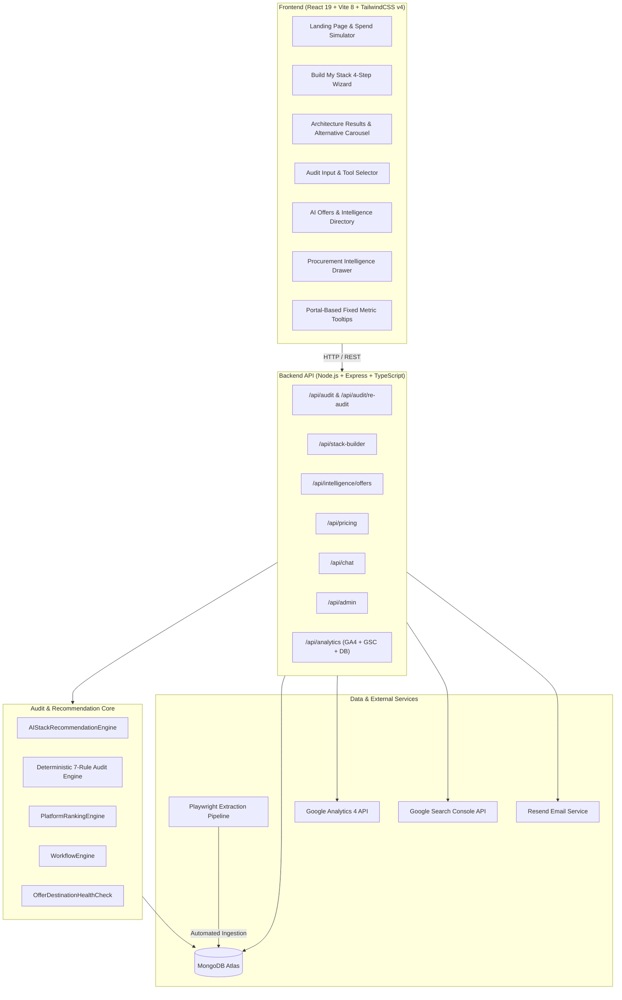
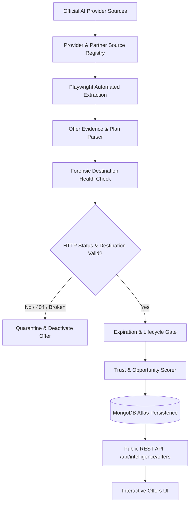
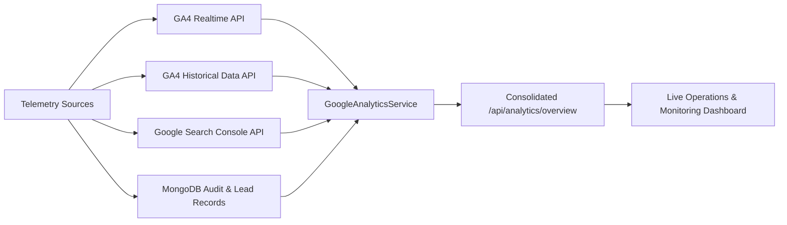
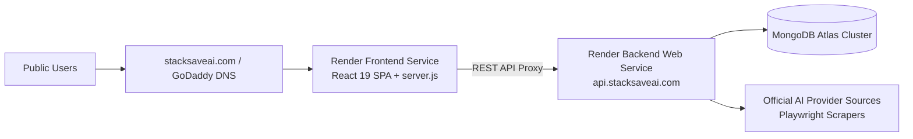

<p align="center">
  <a href="https://stacksaveai.com/">
    
  </a>
</p>

<h1 align="center">StackSave AI</h1>

<h3 align="center">Enterprise AI Spend Intelligence & Autonomous Architecture Recommendation Platform</h3>

<p align="center">
  Eliminate subscription waste, match multi-model capabilities to engineering workflows, and discover 100% verified provider discounts, credits, and partner programs.
</p>

<p align="center">
  <a href="https://stacksaveai.com/"><strong>🌐 Visit Official Website: stacksaveai.com</strong></a>
</p>

<p align="center">
  <a href="https://stacksaveai.com/">Official Website</a> •
  <a href="#ai-offers--pricing-intelligence">AI Offers</a> •
  <a href="#build-my-stack">Build My Stack</a> •
  <a href="#audit-existing-stack">Audit Existing Stack</a> •
  <a href="#analytics--product-intelligence">Analytics</a>
</p>

<p align="center">
  
  
  
  
  
  
  
  
  
</p>

<p align="center">
  <a href="#overview">Overview</a> ·
  <a href="#product-at-a-glance">Product at a Glance</a> ·
  <a href="#why-stacksave">Why StackSave</a> ·
  <a href="#core-features">Features</a> ·
  <a href="#how-it-works">How It Works</a> ·
  <a href="#architecture">Architecture</a><br>
  <a href="#screenshots">Screenshots</a> ·
  <a href="#ai-offers--pricing-intelligence">AI Offers</a> ·
  <a href="#build-my-stack">Build My Stack</a> ·
  <a href="#audit-existing-stack">Audit Existing Stack</a> ·
  <a href="#intelligent-recommendation-system">Recommendation Engine</a><br>
  <a href="#analytics--product-intelligence">Analytics</a> ·
  <a href="#challenges--engineering-solutions">Challenges & Solutions</a> ·
  <a href="#deployment">Deployment</a> ·
  <a href="#technology-stack">Tech Stack</a> ·
  <a href="#getting-started">Getting Started</a> ·
  <a href="#api-reference">API</a>
</p>

---

## Overview

**StackSave AI** is a production AI procurement and spend intelligence platform. It bridges the gap between fragmented vendor pricing models, opaque model capabilities, and rapid promotional discount shifts.

Modern engineering and product teams frequently overpay by **30% or more** on AI software due to overlapping tool subscriptions, unoptimized tier allocations, idle seats, and missed partner programs. StackSave provides two primary intelligence workflows alongside a live promotion engine:

1. **Build My Stack**: Guides teams through domain, budget, and operational requirement inputs to synthesize multi-tiered, cost-optimized AI architectures (Primary Core, Secondary Companion, and API layers) with ranked alternatives.
2. **Audit Existing Stack**: Executes a deterministic, 7-rule mathematical audit against active subscriptions to identify immediate consolidation opportunities, tier downgrades, and annual run-rate savings without LLM math hallucinations.
3. **AI Offers & Pricing Intelligence**: Tracks 29+ official AI provider feeds across 6 structured categories with automated Playwright scrapers and forensic destination health checks.

```
┌─────────────────────────┐     ┌─────────────────────────┐     ┌─────────────────────────┐
│   User Requirements /   │ ──► │  Platform Intelligence  │ ──► │ Verified Vendor Offers  │
│  Existing Subscriptions │     │  & Benchmark Knowledge  │     │   & Pricing Feeds (29+) │
└─────────────────────────┘     └─────────────────────────┘     └─────────────────────────┘
                                                                             │
                                                                             ▼
┌─────────────────────────┐     ┌─────────────────────────┐     ┌─────────────────────────┐
│  Consolidated Monthly / │ ◄── │  Procurement Drawer &   │ ◄── │  Deterministic Rules &  │
│   Annual Net Savings    │     │ Executive PDF Briefing  │     │ Recommendation Engine   │
└─────────────────────────┘     └─────────────────────────┘     └─────────────────────────┘
```

---

## Product at a Glance

| Capability | What StackSave Does | Key Mechanism / Implementation |
| :--- | :--- | :--- |
| **AI Platform Intelligence** | Evaluates AI platforms using multi-signal evidence scoring | `PlatformRankingEngine` (capability, maturity, momentum, value) |
| **AI Offers & Pricing** | Tracks verified official offers, discounts, and credit programs | 29+ monitored providers across 6 structured categories |
| **Build My Stack** | Recommends optimal multi-tier AI architectures based on requirements | Synthesizes Primary, Companion, and API layers with alternative suites |
| **Audit Existing Stack** | Identifies subscription waste, idle seats, and consolidation savings | 7-rule deterministic mathematical audit engine (zero LLM hallucinations) |
| **Analytics & Intelligence** | Monitors real-time product usage, engagement, and global adoption | Google Analytics 4 (Realtime + Historical) & Search Console integration |
| **Offer Verification Pipeline** | Validates official offer origins, lifecycles, and destinations | Automated Playwright extraction, expiration detection & anti-404 health checks |

---

## Why StackSave

| The Challenge | The StackSave Solution |
| :--- | :--- |
| **Fragmented Pricing Models**<br>Seat-based, token-metered, credit tiers, and developer add-ons vary across dozens of providers. | **Unified Spend Normalization**<br>Normalizes seat costs, annual discounts, and team minimums into consistent monthly/annual projections. |
| **Hallucinated Financial Math**<br>Generic LLMs invent inaccurate prices, hallucinate rules, and cannot be audited by finance teams. | **Deterministic Audit Engine**<br>Calculates waste, overlap, and savings using 7 mathematical rules grounded in official catalog data. Zero LLM hallucinations. |
| **Capability Overlap & Redundancy**<br>Teams accidentally pay for multiple identical models across IDEs, chatbots, and APIs. | **Capability Dominance Analysis**<br>Identifies when a primary tool (e.g. Anthropic, OpenAI, Cursor) fully satisfies secondary requirements. |
| **Stale or Expired Coupons**<br>Third-party coupon sites display broken links, expired promo codes, and affiliate spam. | **100% Official Source Pipeline**<br>Direct provider feeds verified via automated Playwright extraction and continuous HTTP health checks. |

---

## Core Features

### 1. Build My Stack (Architecture Synthesis)
- **Guided 4-Step Specification**: Select Operating Domain, Team Scale & Budget Ceiling, Capability Profile, and Strategic Mandate.
- **Multi-Tier Stack Composition**: Generates balanced architectures composed of Primary Core Workhorses, Secondary Companions, Supporting Tools, and API Layers.
- **Alternative Commercial Stacks**: Horizontally scrollable carousel with interactive drag-to-scroll support, showing ranked alternative configurations (e.g., Maximum Performance vs. Best Value).
- **Metric Intelligence Tooltips**: Distinct hover tooltips explaining **Domain Fit** (platform macro domain fit) vs. **Requirement Match** (specific capability satisfaction).
- **Side-by-Side Procurement Drawer**: Deep architectural rationales, requirements coverage checklists, and bottom-line economics.

### 2. Audit Existing Stack (Deterministic Spend Optimization)
- **7 Mathematical Audit Rules**: Evaluates tool redundancy, unused tier entitlements, idle seats, companion downgrade opportunities, and bundle savings.
- **Real-Time Analysis**: Instant savings breakdown showing per-tool impact, monthly savings, annual run-rate recovery, and ROI timeline.
- **Re-Audit Diff Engine**: Tracks historical stack changes and audits over time to measure realized savings.
- **Executive PDF Export**: Generates client-side, CFO-ready procurement briefs via `jsPDF`.

### 3. AI Offers & Pricing Intelligence
- **6 Structured Offer Categories**:
  - `Partner Bundles` (e.g., Amex Platinum, AWS Activate, Microsoft for Startups)
  - `Student & Education` (e.g., GitHub Student Developer Pack, K-12 educator grants)
  - `API Discounts` (e.g., Batch inference pricing, prompt caching, token discounts)
  - `Annual Savings` (e.g., Upfront billing discounts up to 30%)
  - `Startup Grants` (e.g., Cloud incubator and accelerator credits)
  - `Trials & Free Tiers` (e.g., Official developer trials and free community tiers)
- **Dynamic Provider Registry**: Live count of 29+ monitored AI vendors.
- **Forensic Destination Health**: Automated link validation preventing dead URLs or broken redirects.

### 4. Interactive Spend Advisor (AI Chatbot)
- Context-aware chatbot (`ChatBot.tsx` + `/api/chat`) equipped with full knowledge of current AI pricing, plan capabilities, and user stack briefs.

---

## How It Works

```mermaid
flowchart LR
    subgraph Inputs["1. Specification & Audit Inputs"]
        A1[Target Work Domain]
        A2[Team Scale & Budget]
        A3[Granular Capabilities]
        A4[Existing Active Subscriptions]
    end

    subgraph Intelligence["2. Intelligence & Ingestion"]
        B1[Provider Knowledge Catalog]
        B2[Playwright Official Pricing Extractor]
        B3[Partner Discovery & Source Registry]
        B4[Destination Health Checks]
    end

    subgraph Processing["3. Core Processing Engines"]
        C1[Workflow & Domain Fit Engine]
        C2[AI Stack Recommendation Engine]
        C3[Deterministic 7-Rule Audit Engine]
        C4[Platform Ranking Engine]
    end

    subgraph Outputs["4. Intelligence Deliverables"]
        D1[Primary & Alternative Architectures]
        D2[Verified Offer Marketplace]
        D3[Procurement Briefs & PDF Exports]
        D4[Shareable Audit Reports]
    end

    Inputs --> Processing
    Intelligence --> Processing
    Processing --> Outputs
```



---

## Architecture

StackSave is structured as a modern decoupled monorepo with high separation of concerns:



### System Component Responsibilities

| Component | Technology | Core Responsibility |
| :--- | :--- | :--- |
| **Frontend Client** | React 19, Vite 8, Tailwind CSS v4 | SPA rendering, interactive wizards, drag-to-scroll carousels, portal tooltips |
| **Backend API** | Node.js 20+, Express, TypeScript, `tsx` | REST endpoints, rate limiting, request validation, engine orchestration |
| **Recommendation Core** | Custom TypeScript Intelligence Engines | Domain suitability, capability dominance, multi-tier stack synthesis |
| **Audit Engine** | 7-Rule Mathematical Business Logic | Deterministic spend analysis, idle seat detection, annual run-rate savings |
| **Extraction Subsystem** | Playwright 1.62, cheerio | Headless browser extraction from official provider pricing pages |
| **Analytics Subsystem** | `@google-analytics/data`, `googleapis` | Aggregates real-time users, 30-day retention curves, and search queries |
| **Data Layer** | MongoDB Atlas, Mongoose 8.3 | Audits, lead captures, offer cache, and provider metadata persistence |

---

## Screenshots

### Landing Experience
*Clean hero experience featuring an interactive spend simulator that demonstrates real-time savings opportunities, plan upgrades, and duplicate subscription detection.*

<a href="frontend/src/assets/landing%20page.png">
  
</a>

---

### Build My Stack
*Step 1 of the guided architecture wizard: selecting operating domains with a real-time stack brief sidebar updating team seat metrics and spend targets.*

<a href="frontend/src/assets/build%20my%20stack.png">
  
</a>

---

### Audit Existing Stack
*Interactive tool selection matrix across AI IDEs, Chatbots, and APIs with seat counters, billing frequencies, and instant audit summaries.*

<a href="frontend/src/assets/audit%20exisiting%20stack.png">
  
</a>

---

### AI Offers & Pricing Intelligence
*6-category verified promotion directory featuring provider filters, official verification timestamps, opportunity scoring badges, and direct vendor destinations.*

<a href="frontend/src/assets/ai%20offers.png">
  
</a>

---

### Analytics Dashboard
*StackSave integrates interactive analytics telemetry to monitor user adoption, global audience engagement, and platform retention curves via Google Analytics 4.*

<table>
  <tr>
    <td width="50%">
      <h4 align="center">User Activity & Engagement Telemetry</h4>
      <a href="frontend/src/assets/user%20analytics.png">
        
      </a>
      <p align="center"><em>Active user trajectories (30-day, 7-day, 1-day), real-time concurrent sessions, and average engagement time per user (~2m 23s).</em></p>
    </td>
    <td width="50%">
      <h4 align="center">Global Active User Distribution</h4>
      <a href="frontend/src/assets/world%20wide%20users.png">
        
      </a>
      <p align="center"><em>Live geographic audience breakdown monitoring user activity across India, Czechia, the United States, Netherlands, and globally.</em></p>
    </td>
  </tr>
</table>

---

## AI Offers & Pricing Intelligence

The AI Offers directory (`/offers`) provides verified procurement opportunities derived directly from official AI platform ecosystems. StackSave **does not** scrape unverified coupon forums or affiliate aggregators.



### Verification Pipeline Architecture
1. **Source Registry & Official Feeds**: Monitors 29+ official vendor domains (OpenAI, Anthropic, Google Cloud, Cursor, Windsurf, Perplexity, DeepSeek, etc.).
2. **Autonomous Playwright Extraction**: Headless browser workers navigate pricing tables and partner portals, capturing structured discounts, plan IDs, and eligibility terms.
3. **Forensic Destination Health Check**: Automated HTTP pingers and redirect inspectors verify that every destination URL is active, eliminating 404s and expired promo landing pages.
4. **Dynamic Expiration & Lifecycle Handling**: Parses natural language expiration dates (e.g. *"through June 2028"*, *"limited to Q3"*) and automatically retires expired offers.
5. **Provider-Grouped Ranking**: Groups offers by canonical AI platform (`aiProvider`) sorted by platform intelligence first, then best verified discount, ensuring frontier platforms remain prominent.
6. **Opportunity Scoring**: Calculates an evidence-based `offerOpportunityScore` weighing cash value, duration, tier entitlement, and verification freshness.

---

## Build My Stack

The **Build My Stack** workflow (`/build-stack`) constructs production-grade AI software suites tailored to specific business workflows.

### 6-Step Generation Process
1. **User Defines Specifications**: Operating domain, team scale, budget target, and granular feature requirements.
2. **Capability Profiling**: Evaluates platform capability vectors across code generation, reasoning, multimodal analysis, and document parsing.
3. **Domain Fit Computation**: `WorkflowEngine` calculates how naturally the platform's profile aligns with the selected industry vertical.
4. **Requirement Matching**: Calculates exact feature satisfaction percentages against requested capabilities.
5. **Candidate Architecture Ranking**: Synthesizes Primary Workhorses, Secondary Companions, and API Layers with alternative commercial configurations.
6. **Inspection & Activation**: Users inspect detailed procurement drawers and activate alternative architectures with a single click.

### Metric Clarity: Domain Fit vs. Requirement Match

```
┌──────────────────────────────────────┐     ┌──────────────────────────────────────┐
│  Domain Fit                     78%  │     │  Requirement Match              91%  │
│                                      │     │                                      │
│  How well this platform's            │     │  How closely this platform satisfies │
│  capabilities fit your selected      │     │  the specific requirements you       │
│  work domain.                        │     │  provided.                           │
│                                      │     │                                      │
│  AI & Machine Learning               │     │  Selected Capabilities Match         │
│  Strong fit for this domain.         │     │  Evaluates operational features met. │
└──────────────────────────────────────┘     └──────────────────────────────────────┘
```

- **Domain Fit**: Measures macro industry suitability (e.g., how appropriate Cursor or Google Antigravity is for *Software Engineering* vs. *Content & Writing*).
- **Requirement Match**: Measures micro feature satisfaction (e.g., how completely the platform satisfies *in-editor code generation*, *deep reasoning*, and *document processing*).
- **Portal Tooltips**: Tooltips render via React Portals on `document.body` with fixed viewport clamping, eliminating clipping inside horizontal scroll carousels.

---

## Audit Existing Stack

The **Audit Existing Stack** workflow (`/audit`) evaluates existing software subscriptions using a 7-rule deterministic audit engine:

1. **Duplicate AI Tool Redundancy**: Identifies overlapping subscriptions across multiple vendors (e.g., paying for both Cursor Pro and GitHub Copilot for the same engineering seats).
2. **Unused Tier Downgrade**: Flags team seats that do not consume enterprise-tier features and can safely transition to standard plans.
3. **Idle Seat Waste**: Detects excess seat purchases relative to actual team size requirements.
4. **API vs. Chat Misallocation**: Recommends cost-effective API token endpoints for batch workloads currently routed through expensive seat-based chat subscriptions.
5. **Annual Billing Optimization**: Calculates run-rate savings achieved by switching eligible monthly subscriptions to discounted annual agreements.
6. **Partner Credits & Grants**: Surfaces eligible startup and corporate credits directly applicable to the audited stack.
7. **Bundle Consolidation**: Discovers multi-tool vendor bundles that reduce total per-seat expense.

---

## Intelligent Recommendation System

StackSave utilizes `PlatformRankingEngine` to compute deterministic, evidence-grounded competitive scores for all AI platforms in the ecosystem without hardcoded brand bias:

| Ranking Signal | Weight | What It Measures |
| :--- | :---: | :--- |
| **Market Adoption** | **25%** | Active developer usage, enterprise deployment scale, and community sentiment |
| **Product Capabilities** | **25%** | Frontier benchmark quality, reasoning depth, context windows, and code refactoring scores |
| **Ecosystem Strength** | **15%** | IDE plugins, third-party integrations, SDK availability, and workflow interoperability |
| **Growth Momentum** | **10%** | Velocity of frontier model releases, developer adoption trajectory, and update cadence |
| **Reliability & Maturity** | **10%** | Enterprise uptime, SOC 2 / HIPAA compliance, zero data retention policies, and SLA stability |
| **Value for Money** | **10%** | Price-to-performance ratio across seat costs, rate limits, and token pricing |
| **Partner Offer Value** | **5%** | Active presence of verified credits, student programs, startup grants, or bundled savings |
| **Confidence Score** | *Gate* | Completeness of verified pricing, benchmark data, and official documentation (0.0 – 1.0) |

---

## Analytics & Product Intelligence

StackSave integrates multi-source analytics telemetry to monitor application performance, user acquisition, and intelligence throughput:



### Semantic Separation of Analytics Data
To prevent misleading composite statistics, StackSave maintains strict semantic separation between data sources:
- **Product & User Analytics (GA4)**: Real-time concurrent visitors, 30-day active user trajectories, and user engagement time (~2m 23s avg).
- **Search & Discovery Analytics (GSC)**: Organic impressions, click-through rates, and keyword search performance (`GSC_SITE_URL`).
- **Application & Database Metrics (MongoDB)**: Total audits executed, cumulative spend analyzed, net savings identified, and procurement briefs delivered.

---

## Challenges & Engineering Solutions

### 1. Dynamic AI Offer Expiration & Phantom Deals
- **Challenge**: AI vendor promotions, accelerator credits, and partner bundles expire or change terms without standard RSS feeds.
- **Solution**: Built an autonomous Playwright extraction engine coupled with natural language expiration parsing and automated quarantine gates.

### 2. Stale Destination URLs & 404 Prevention
- **Challenge**: Partner promotion links (e.g. Gemini with hardware partners or Perplexity bundles) frequently change destinations, producing broken links.
- **Solution**: Developed `offerDestinationHealthCheck.ts` to perform forensic HTTP pinging, redirect tracing, and automated destination reconciliation before surfacing offers.

### 3. Canonical Provider vs. Commercial Partner Identity
- **Challenge**: Multiple commercial partners offer the same platform (e.g., Gemini via ASUS, Pixel, and Jio), which risked cluttering rankings with duplicate platform entries.
- **Solution**: Decoupled canonical AI provider identity (`aiProvider: 'gemini'`) from partner distributor identity (`partnerId`), grouping verified offers under unified platform banners.

### 4. Fair Recommended Platform Ranking
- **Challenge**: A minor platform offering a 90% discount could mathematically outrank a primary enterprise platform if sorting purely by discount magnitude.
- **Solution**: Implemented a two-tier sorting algorithm: platform groups are sorted primarily by **Platform Intelligence Score**, with the top verified offer acting as a secondary tiebreaker.

### 5. Analytics Semantic Integrity
- **Challenge**: Combining Google Analytics sessions, Google Search Console clicks, and database audit records into a single metric creates misleading numbers.
- **Solution**: Created `GoogleAnalyticsService` with distinct `MetricCardValue` models explicitly declaring `dataSource: 'GA4_REALTIME' | 'GA4_HISTORICAL' | 'GOOGLE_SEARCH_CONSOLE' | 'STACKSAVE_MONGODB'`.

### 6. Zero-Friction Horizontal Card Dragging
- **Challenge**: CSS `scroll-snap-type: x mandatory` fought mouse dragging on alternative architecture cards, and drag gestures accidentally triggered card clicks.
- **Solution**: Implemented unified Pointer Events with `setPointerCapture`, dynamically disengaged snap during active dragging (`scrollSnapType: isGrabbing ? 'none' : 'x proximity'`), and added capture-phase click suppression.

---

## Deployment

StackSave is deployed in production across Render, MongoDB Atlas, and GoDaddy:



### Production Infrastructure

| Layer | Service Provider | Production Hostname / Configuration |
| :--- | :--- | :--- |
| **Official Domain & DNS** | **GoDaddy** | `https://stacksaveai.com/` (Apex & CNAME routing) |
| **Frontend Web Service** | **Render** | `stacksave-frontend` (`node server.js`, SPA history fallback, caching) |
| **Backend API Service** | **Render** | `stacksave-backend` (`https://api.stacksaveai.com/`, health check `/api/health`) |
| **Database** | **MongoDB Atlas** | Managed replica set with Mongoose connection pooling |
| **Scheduled Sync** | **GitHub Actions** | Automated cron workflow executing pricing synchronization and dry-runs |

---

## Technology Stack

| Layer | Technologies | Purpose |
| :--- | :--- | :--- |
| **Frontend Framework** | **React 19.2**, TypeScript, Vite 8.1 | High-performance SPA with fast HMR and client bundle chunking |
| **Styling & UI** | **Tailwind CSS v4**, Framer Motion 12.38 | Modern design system, micro-interactions, portal-based tooltips |
| **Data Visualization** | Recharts 3.8, jsPDF 4.2 | Interactive spend distribution charts and executive PDF reports |
| **Backend Runtime** | **Node.js 20+**, Express 4.18, `tsx` | REST API, rate-limiting, security middleware, and pipeline orchestration |
| **Database & ORM** | **MongoDB Atlas**, Mongoose 8.3 | Document store for audits, provider knowledge, and offer registries |
| **Automated Extraction** | **Playwright 1.62** | Automated browser scraping of official vendor pricing pages |
| **Analytics Telemetry** | `@google-analytics/data`, `googleapis` | GA4 Realtime, Historical, and Search Console data integration |
| **AI Summarization** | Groq API (`llama-3.3-70b`), OpenAI API | Natural language narrative generation for executive briefing notes |
| **Email & Delivery** | Resend API 3.3 | Transactional audit reports and procurement brief delivery |
| **Quality & Testing** | **Vitest 1.5**, ESLint 8 / typescript-eslint | 35 comprehensive unit and integration test suites |
| **Hosting & CI/CD** | Render, GoDaddy, GitHub Actions | Continuous deployment, automated dry-runs, scheduled pricing sync |

---

## Project Structure

```
StackSave/
├── .github/workflows/
│   ├── ci.yml                           # Continuous integration & test automation
│   ├── pricing-sync.yml                 # Automated cron pricing sync workflow
│   └── pricing-sync-dryrun.yml          # Staging dry-run verification
│
├── frontend/
│   ├── src/
│   │   ├── assets/                      # Brand assets, trimmed SVGs, and screenshots
│   │   ├── components/                  # Reusable UI components, modals, and drawers
│   │   │   ├── intelligence/            # ProcurementDrawer, DecisionReportModal
│   │   │   ├── MetricTooltip.tsx        # Portal-based viewport-aware metric tooltips
│   │   │   ├── ChatBot.tsx              # Interactive AI Spend Assistant
│   │   │   └── ProviderLogo.tsx         # Unified vector provider iconography
│   │   ├── pages/                       # Application route views
│   │   │   ├── LandingPage.tsx          # Marketing hero, live simulator, value props
│   │   │   ├── BuildStackPage.tsx       # 4-step architecture specification wizard
│   │   │   ├── BuildStackResultsPage.tsx# Assembled architecture & alternative cards
│   │   │   ├── AuditPage.tsx            # Existing stack selection & spend configuration
│   │   │   ├── ResultsPage.tsx          # Deterministic audit savings report
│   │   │   ├── OffersPage.tsx           # 6-category verified AI offers directory
│   │   │   └── ReAuditDiffPage.tsx      # Spend delta comparison across audit runs
│   │   ├── services/                    # Axios API client and PDF generation
│   │   └── types/                       # TypeScript schemas and domain models
│   ├── package.json
│   └── vite.config.ts
│
├── backend/
│   ├── src/
│   │   ├── audit-engine/                # Deterministic spend & recommendation core
│   │   │   ├── services/                # Recommendation, Ranking, and Domain engines
│   │   │   ├── catalog.ts               # Core AI tool capabilities and plan data
│   │   │   └── rules.ts                 # 7 mathematical audit rules
│   │   ├── pricing/                     # Ingestion & verification subsystem
│   │   │   ├── adapters/                # Vendor-specific pricing parsers (ChatGPT, Claude, etc.)
│   │   │   ├── offerDestinationHealthCheck.ts # Link validator & anti-404 safeguard
│   │   │   ├── syncOrchestrator.ts      # Multi-signal offer synchronization pipeline
│   │   │   └── sourceRegistry.ts        # Official provider registry & feeds
│   │   ├── routes/                      # Express route controllers
│   │   │   ├── audit.ts                 # Audit submission, calculations, re-audits
│   │   │   ├── stackBuilder.ts          # Recommendation synthesis endpoint
│   │   │   ├── intelligence.ts          # Verified AI offers & ranking endpoint
│   │   │   ├── analytics.ts             # GA4 & Search Console telemetry endpoint
│   │   │   └── chat.ts                  # Spend assistant chat endpoint
│   │   ├── services/                    # Database, email, analytics, and AI services
│   │   └── app.ts                       # Express server initialization & middleware
│   ├── tests/                           # 35 Vitest integration & unit test suites
│   ├── package.json
│   └── tsconfig.json
│
└── README.md
```

---

## Getting Started

### Prerequisites
- **Node.js**: v20.x or higher
- **npm**: v10.x or higher
- **MongoDB**: Active MongoDB Atlas cluster or local MongoDB instance (v6.0+)
- **API Keys** (Optional for basic development, required for full features):
  - Groq API Key (for narrative summaries)
  - Resend API Key (for transactional emails)
  - Google Service Account (for GA4 analytics integration)

### 1. Clone the Repository
```bash
git clone https://github.com/your-username/stacksave.git
cd stacksave
```

### 2. Backend Setup
```bash
cd backend
cp .env.example .env
npm install
```

Configure your `backend/.env`:
```env
PORT=5000
NODE_ENV=development
MONGODB_URI=mongodb+srv://<username>:<password>@cluster.mongodb.net/stacksave?retryWrites=true&w=majority
FRONTEND_URL=http://localhost:5173
GROQ_API_KEY=gsk_your_groq_key_here
RESEND_API_KEY=re_your_resend_key_here
```

Start the backend development server:
```bash
npm run dev
# Server running at http://localhost:5000
# Health check: http://localhost:5000/api/health
```

### 3. Frontend Setup
In a new terminal window:
```bash
cd frontend
cp .env.example .env
npm install
```

Configure `frontend/.env`:
```env
VITE_API_BASE_URL=http://localhost:5000/api
VITE_API_URL=http://localhost:5000/api
```

Start the Vite development server:
```bash
npm run dev
# Application running at http://localhost:5173
```

---

## Environment Variables

### Backend (`backend/.env`)

| Variable | Required | Default | Description |
| :--- | :---: | :--- | :--- |
| `PORT` | No | `5000` | Port on which the Express server listens |
| `NODE_ENV` | No | `development` | Environment mode (`development` / `production`) |
| `MONGODB_URI` | **Yes** | — | MongoDB connection URI string |
| `FRONTEND_URL` | **Yes** | `http://localhost:5173` | Allowed origin for CORS headers |
| `GROQ_API_KEY` | No | — | Groq LLM key for narrative summary generation |
| `RESEND_API_KEY` | No | — | Resend API key for emailing audit reports |
| `ADMIN_SECRET` | No | — | Bearer secret for protected `/api/admin/*` endpoints |
| `GA4_PROPERTY_ID` | No | — | Google Analytics 4 property ID for live metrics |
| `GOOGLE_SERVICE_ACCOUNT_KEY` | No | — | JSON service account credentials for Google APIs |
| `GSC_SITE_URL` | No | — | Google Search Console site identifier |

### Frontend (`frontend/.env`)

| Variable | Required | Default | Description |
| :--- | :---: | :--- | :--- |
| `VITE_API_BASE_URL` | **Yes** | `http://localhost:5000/api` | Base URL for backend REST API requests |
| `VITE_API_URL` | No | `http://localhost:5000/api` | Fallback API endpoint URL |

---

## API Reference

### Core Endpoints

| Method | Endpoint | Description |
| :--- | :--- | :--- |
| `GET` | `/api/health` | Service health status and timestamp verification |
| `POST` | `/api/audit` | Execute 7-rule deterministic audit against user stack subscriptions |
| `GET` | `/api/audit/:id` | Retrieve an existing saved audit report by ID |
| `POST` | `/api/audit/re-audit` | Compare an updated stack against a previous audit to calculate savings deltas |
| `POST` | `/api/stack-builder/recommend` | Synthesize optimized multi-tier stack and ranked alternatives |
| `GET` | `/api/intelligence/offers` | Fetch verified AI offers categorized, ranked, and verified |
| `GET` | `/api/pricing/providers` | Retrieve dynamic count and status of all monitored AI vendors |
| `GET` | `/api/analytics/overview` | Fetch consolidated GA4, Search Console, and database telemetry |
| `GET` | `/api/analytics/realtime` | Fetch active user count in last 30 minutes from GA4 Realtime API |
| `POST` | `/api/chat` | Contextual AI spend assistant conversation endpoint |
| `POST` | `/api/leads` | Save verified procurement brief lead and trigger email delivery |

<details>
<summary><strong>View Example Request: POST /api/audit</strong></summary>

```json
{
  "tools": [
    {
      "toolId": "cursor",
      "planId": "pro",
      "seats": 10,
      "billingCycle": "monthly"
    },
    {
      "toolId": "chatgpt",
      "planId": "plus",
      "seats": 10,
      "billingCycle": "monthly"
    }
  ],
  "teamSize": 10,
  "optimizationGoal": "balanced",
  "companyName": "Acme Engineering"
}
```

</details>

---

## Testing

StackSave includes 35 comprehensive test suites powered by **Vitest**, covering deterministic audit rules, offer lifecycle validation, destination health checks, and ranking fairness:

```bash
# Run all backend tests
cd backend
npm test

# Run tests in watch mode
npm run test:watch

# Execute frontend typecheck and production build test
cd ../frontend
npm run typecheck
npm run build
```

---

## Roadmap

- [x] **Phase 1**: Deterministic 7-rule audit engine and client-side PDF export.
- [x] **Phase 2**: 6-category verified AI offers directory with Playwright extraction.
- [x] **Phase 3**: Multi-tier "Build My Stack" architecture recommendation engine.
- [x] **Phase 4**: Dual-metric clarification tooltips (Domain Fit vs. Requirement Match).
- [x] **Phase 5**: Interactive drag-to-scroll alternative commercial stack carousel.
- [x] **Phase 6**: Production deployment to Render with custom domain (`stacksaveai.com`) and GA4 integration.
- [ ] **Phase 7**: Enterprise SSO / OAuth integration and automated Google Workspace / Okta seat auditor.
- [ ] **Phase 8**: Real-time webhook alerts for provider price hikes and surprise renewals.

---

## Contributing

Contributions, bug reports, and feature proposals are welcome.

1. Fork the project repository.
2. Create a feature branch: `git checkout -b feature/platform-intelligence-extension`.
3. Commit your changes: `git commit -m 'feat: add deep research provider adapter'`.
4. Push to the branch: `git push origin feature/platform-intelligence-extension`.
5. Open a Pull Request with a clear description and accompanying Vitest unit tests.

---

## License

This project is licensed under the [MIT License](./LICENSE).

---

<p align="center">
  <a href="https://stacksaveai.com/"><strong>StackSave AI</strong></a> — Precision spend intelligence for engineering leaders and AI procurement teams.
</p>
