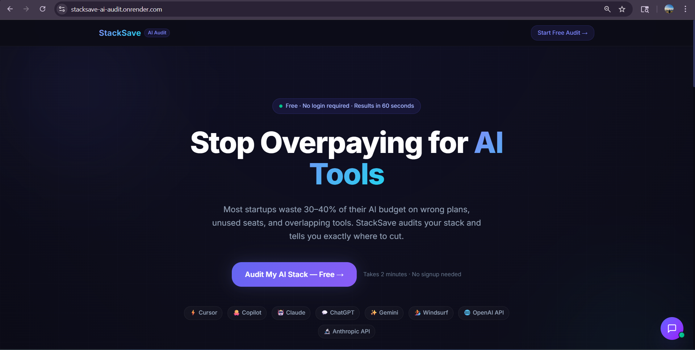
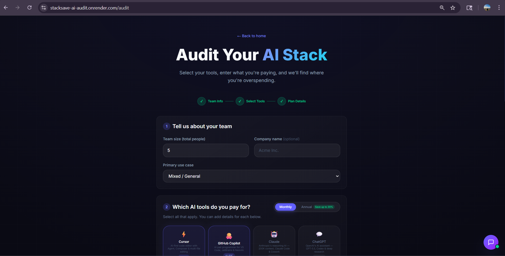
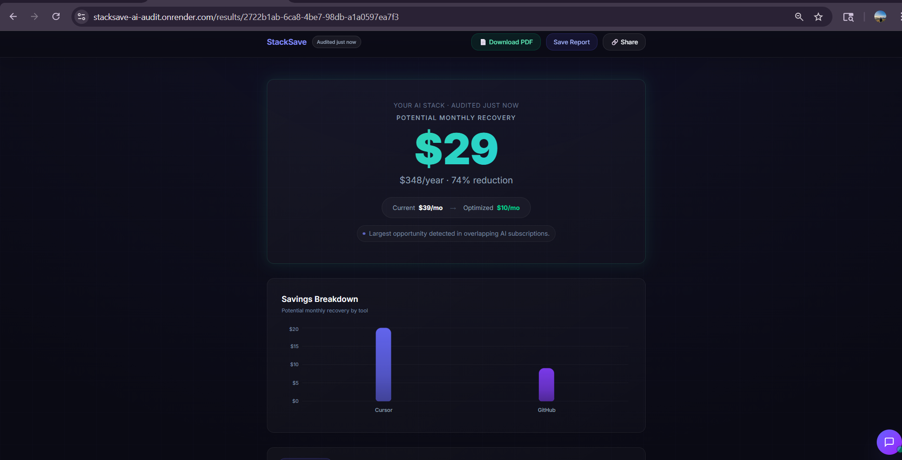

# StackSave AI Audit

**Free AI spend optimization for startups and engineering teams.**
Enter your AI tool subscriptions, get an instant audit showing where you're overspending, what to cut, and how much you'll save — monthly and annually. No login required.

> Built as part of the Credex Web Development Intern Assignment (May 2026).

---

## Live Demo

🔗 **[stacksave-ai-audit.onrender.com](https://stacksave-ai-audit.onrender.com)**  
🔧 **[Backend health check](https://stacksave-backend.onrender.com/api/health)**

> _Note: Hosted on Render free tier — first load may take ~30 seconds if the instance is spun down._

---

## Product Preview

### 🏠 Landing Page
Clean, conversion-optimized landing page with clear value proposition and instant audit access.



### ⚙️ Audit Configuration
Intuitive tool selection with real-time pricing, plan features, and smart seat calculations.



### 📊 Optimization Report
Comprehensive savings dashboard with per-tool insights, AI summary, and actionable recommendations.



---

**Key Features Shown:**
- ✅ Real-time pricing from official vendor sources
- ✅ Intelligent seat optimization and plan recommendations  
- ✅ Interactive audit flow with progressive disclosure
- ✅ Professional report with shareable URLs
- ✅ PDF export for executive presentations

> _Full product walkthrough available on the live demo: [stacksave-ai-audit.onrender.com](https://stacksave-ai-audit.onrender.com)_

---

## What It Does

1. **You input your AI stack** — select tools (Cursor, ChatGPT, Claude, GitHub Copilot, etc.), choose your plan, enter team size and seats.
2. **A deterministic engine audits it** — 7 rule-based checks fire against real vendor pricing data. No LLM math.
3. **You get a report** — per-tool insights with savings amounts, an AI-generated summary paragraph, and a shareable public URL.
4. **Optional email capture** — enter your email to receive the report. High-savings audits surface a Credex CTA.

---

## Quick Start

### Prerequisites

- Node.js 20+
- MongoDB Atlas account (free `M0` tier works)
- [Groq API key](https://console.groq.com) — free, no credit card
- [Resend API key](https://resend.com) — free tier, 3,000 emails/month

### 1. Clone and install

```bash
git clone https://github.com/your-username/stacksave.git
cd stacksave
```

### 2. Backend setup

```bash
cd backend
cp .env.example .env
```

Fill in `.env`:

```env
MONGODB_URI=mongodb+srv://<user>:<password>@<cluster>.mongodb.net/stacksave
GROQ_API_KEY=gsk_...
RESEND_API_KEY=re_...
FRONTEND_URL=http://localhost:5173
PORT=5000
NODE_ENV=development
```

```bash
npm install
npm run dev
# → http://localhost:5000
# → Health check: http://localhost:5000/api/health
```

### 3. Frontend setup

```bash
cd frontend
cp .env.example .env
```

`.env` should contain:

```env
VITE_API_BASE_URL=http://localhost:5000/api
```

```bash
npm install
npm run dev
# → http://localhost:5173
```

### 4. Run tests

```bash
cd backend
npm test
# 16 tests, all passing
```

### 5. Deploy to Render

Both `render.yaml` files are pre-configured. Push to GitHub, connect the repo in Render, add the environment variables, and deploy. See [DEPLOYMENT.md](./DEPLOYMENT.md) for the full walkthrough.

---

## Key Decisions

Five real tradeoffs made during this build — not hypothetical, these are the ones that shaped the actual architecture:

**1. Deterministic audit engine over LLM-generated insights**
The audit math — savings amounts, rule triggers, spend comparisons — uses hardcoded rule logic against verified pricing data, not AI. LLMs hallucinate prices confidently. A finance person looking at "$340/month in savings" needs to be able to trace that number to a specific rule and a specific pricing source. AI is used for one thing only: the prose summary paragraph, where approximate language is fine and errors are low-stakes.

**2. MongoDB over PostgreSQL/Supabase**
Each audit stores an `insights` array where the objects have variable shape depending on which of 7 rules fired. In Postgres, this means either a JSON column (same behavior as MongoDB), a wide nullable table, or normalized joins for no query benefit — audits are always read in full, never queried by field. MongoDB's document model is genuinely the right fit here, not just the convenient one.

**3. Client-side PDF (jsPDF) over server-side rendering (Puppeteer)**
jsPDF generates the PDF entirely in the browser in ~200ms — no server compute, no processing queue, no cold-start risk. The tradeoff is that the PDF is drawn with primitives (rectangles, text) rather than rendering the React UI, so it looks different from the web results page. Acceptable for an MVP where "share with your team" is the use case. Puppeteer would be the right call if CFO-grade report quality became a product priority.

**4. Honeypot + rate limiting over hCaptcha**
hCaptcha adds a friction step at lead capture — exactly where friction kills conversion. A honeypot hidden field (bots fill it, humans don't) plus `express-rate-limit` at 20 audits/hour/IP stops automated abuse without degrading the UX for real users.

**5. Synchronous AI summary for MVP simplicity**
`POST /api/audits` waits for the Grok API response before returning. This adds ~1–2 seconds to the request. The cleaner architecture is async — return the audit result immediately, queue the AI summary, push it via WebSocket or polling. That's documented in [ARCHITECTURE.md](./ARCHITECTURE.md) under "What I'd Change at 10k Audits/Day." For an MVP doing <100 audits/day, the simpler synchronous path was the right call.

---

## Tech Stack

| Layer | Technology |
|---|---|
| Frontend | React 19 + TypeScript + Vite |
| Styling | Tailwind CSS v4 |
| Animations | Framer Motion |
| Charts | Recharts |
| HTTP | Axios |
| Routing | React Router v7 |
| Backend | Node.js + Express + TypeScript |
| Database | MongoDB Atlas (Mongoose) |
| AI | Groq API — `llama-3.3-70b-versatile` (audit summaries), `llama-3.1-8b-instant` (chatbot) |
| Email | Resend |
| PDF | jsPDF (client-side) |
| Testing | Vitest |
| CI | GitHub Actions |
| Deployment | Render (frontend + backend) |

---

## Project Structure

```
StackSave/
├── frontend/src/
│   ├── pages/          # LandingPage, AuditPage, ResultsPage, SharedAuditPage
│   ├── components/     # ChatBot (floating AI assistant)
│   ├── services/       # api.ts, pdfService.ts
│   ├── hooks/          # useAudit, useLocalStorage
│   └── data/           # tools.ts — frontend tool + plan catalog
│
├── backend/src/
│   ├── audit-engine/   # catalog.ts, rules.ts, engine.ts — pure business logic, no I/O
│   ├── routes/         # audit, leads, chat, health
│   ├── services/       # aiService, dbService, emailService
│   └── middleware/     # rateLimit, validation, honeypot, logger
│
└── backend/tests/
    └── audit-engine.test.ts   # 16 unit tests
```

---

## Entrepreneurial Context

StackSave is a lead-generation tool for [Credex](https://credex.rocks), which sources discounted AI infrastructure credits. The product strategy — funnel economics, GTM, success metrics — is documented in:

- [ECONOMICS.md](./ECONOMICS.md) — unit economics and conversion funnel math
- [GTM.md](./GTM.md) — launch channels and distribution plan
- [METRICS.md](./METRICS.md) — what success looks like at each stage
- [ARCHITECTURE.md](./ARCHITECTURE.md) — system design and scaling plan
