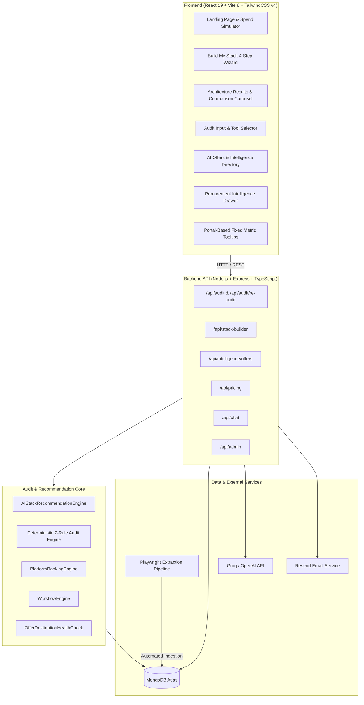

<p align="center">
  
</p>

<h1 align="center">StackSave AI</h1>

<p align="center">
  <strong>Enterprise AI Spend Intelligence & Autonomous Architecture Recommendation Platform</strong>
</p>

<p align="center">
  Eliminate subscription waste, match multi-model capabilities to engineering workflows, and discover 100% verified provider discounts, credits, and partner programs.
</p>

<p align="center">
  
  
  
  
  
  
  
  
  
</p>

<p align="center">
  <a href="#overview">Overview</a> •
  <a href="#why-stacksave">Why StackSave</a> •
  <a href="#core-features">Core Features</a> •
  <a href="#how-it-works">How It Works</a> •
  <a href="#architecture">Architecture</a> •
  <a href="#screenshots">Screenshots</a> •
  <a href="#ai-offers--pricing-intelligence">AI Offers</a> •
  <a href="#build-my-stack">Build My Stack</a> •
  <a href="#audit-existing-stack">Audit Existing Stack</a> •
  <a href="#technology-stack">Tech Stack</a> •
  <a href="#getting-started">Getting Started</a> •
  <a href="#api-reference">API</a>
</p>

---

## Overview

**StackSave AI** is an intelligent AI procurement and spend optimization platform. It bridges the gap between fragmented AI pricing tiers, opaque model capabilities, and rapid vendor discount shifts.

Modern engineering and product teams frequently overpay by **30% or more** on AI software due to overlapping tool capabilities, unoptimized tier allocations, forgotten seats, and missed partner grants. StackSave provides two primary intelligence workflows alongside a live promotion engine:

1. **Build My Stack**: Guides teams through domain, budget, and operational requirement inputs to synthesize multi-tiered, cost-optimized AI architectures (Primary, Secondary Companion, and API layers) with ranked alternatives.
2. **Audit Existing Stack**: Executes a deterministic, 7-rule mathematical audit against active subscriptions to identify immediate consolidation opportunities, tier downgrades, and annual run-rate savings.
3. **AI Offers & Pricing Intelligence**: Tracks 29+ official AI provider feeds across 6 structured categories with automated Playwright scrapers and destination health checks to ensure zero broken links.

```
┌─────────────────────────┐     ┌─────────────────────────┐     ┌─────────────────────────┐
│   User Requirements /   │ ──► │  Platform Intelligence  │ ──► │ Verified Vendor Offers  │
│  Existing Subscriptions │     │  & Benchmark Knowledge  │     │   & Pricing Feeds (29+) │
└─────────────────────────┘     └─────────────────────────┘     └─────────────────────────┘
                                                                             │
                                                                             ▼
┌─────────────────────────┐     ┌─────────────────────────┐     ┌─────────────────────────┐
│  Consolidated Monthly / │ ◄── │  Procurement Drawer &   │ ◄── │  Deterministic Rules &  │
│   Annual Net Savings    │     │ Executive PDF Briefing  │     │ Recommendation Engine   │
└─────────────────────────┘     └─────────────────────────┘     └─────────────────────────┘
```

---

## Why StackSave

| The Challenge | The StackSave Solution |
| :--- | :--- |
| **Fragmented Pricing Models**<br>Seat-based, token-metered, credit tiers, and developer add-ons vary across dozens of providers. | **Unified Spend Normalization**<br>Normalizes seat costs, annual discounts, and team minimums into consistent monthly/annual projections. |
| **Hallucinated Financial Math**<br>Generic LLMs invent inaccurate prices, hallucinate rules, and cannot be audited by finance teams. | **Deterministic Audit Engine**<br>Calculates waste, overlap, and savings using 7 mathematical rules grounded in official catalog data. Zero LLM hallucinations. |
| **Capability Overlap & Redundancy**<br>Teams accidentally pay for multiple identical models across IDEs, chatbots, and APIs. | **Capability Dominance Analysis**<br>Identifies when a primary tool (e.g. Anthropic, OpenAI, Cursor) fully satisfies secondary requirements. |
| **Stale or Expired Coupons**<br>Third-party coupon sites display broken links, expired promo codes, and affiliate spam. | **100% Official Source Pipeline**<br>Direct provider feeds verified via automated Playwright extraction and continuous HTTP health checks. |

---

## Core Features

### 1. Build My Stack (Architecture Synthesis)
- **Guided 4-Step Specification**: Select Operating Domain, Team Scale & Budget Ceiling, Capability Profile, and Strategic Mandate.
- **Multi-Tier Stack Composition**: Generates balanced architectures composed of Primary Core Workhorses, Secondary Companions, Supporting Tools, and API Layers.
- **Alternative Commercial Stacks**: Horizontally scrollable carousel with interactive drag-to-scroll support, showing ranked alternative configurations (e.g., Maximum Performance vs. Best Value).
- **Metric Intelligence Tooltips**: Distinct hover tooltips explaining **Domain Fit** (platform macro domain fit) vs. **Requirement Match** (specific capability satisfaction).
- **Side-by-Side Procurement Drawer**: Deep architectural rationales, requirements coverage checklists, and bottom-line economics.

### 2. Audit Existing Stack (Deterministic Spend Optimization)
- **7 Mathematical Audit Rules**: Evaluates tool redundancy, unused tier entitlements, idle seats, companion downgrade opportunities, and bundle savings.
- **Real-Time Analysis**: Instant savings breakdown showing per-tool impact, monthly savings, annual run-rate recovery, and ROI timeline.
- **Re-Audit Diff Engine**: Tracks historical stack changes and audits over time to measure realized savings.
- **Executive PDF Export**: Generates client-side, CFO-ready procurement briefs via `jsPDF`.

### 3. AI Offers & Pricing Intelligence
- **6 Structured Offer Categories**:
  - `Partner Bundles` (e.g., Amex Platinum, AWS Activate, Microsoft for Startups)
  - `Student & Education` (e.g., GitHub Student Developer Pack, K-12 educator grants)
  - `API Discounts` (e.g., Batch inference pricing, prompt caching, token discounts)
  - `Annual Savings` (e.g., Upfront billing discounts up to 30%)
  - `Startup Grants` (e.g., Cloud incubator and accelerator credits)
  - `Trials & Free Tiers` (e.g., Official developer trials and free community tiers)
- **Dynamic Provider Registry**: Live count of 29+ monitored AI vendors.
- **Forensic Destination Health**: Automated link validation preventing dead URLs or broken redirects.

### 4. Interactive Spend Advisor (AI Chatbot)
- Context-aware chatbot (`ChatBot.tsx` + `/api/chat`) equipped with full knowledge of current AI pricing, plan capabilities, and user stack briefs.

---

## How It Works

```mermaid
flowchart LR
    subgraph Inputs["1. Specification & Audit Inputs"]
        A1[Target Work Domain]
        A2[Team Scale & Budget]
        A3[Granular Capabilities]
        A4[Existing Active Subscriptions]
    end

    subgraph Intelligence["2. Intelligence & Ingestion"]
        B1[Provider Knowledge Catalog]
        B2[Playwright Official Pricing Extractor]
        B3[Partner Discovery & Source Registry]
        B4[Destination Health Checks]
    end

    subgraph Processing["3. Core Processing Engines"]
        C1[Workflow & Domain Fit Engine]
        C2[AI Stack Recommendation Engine]
        C3[Deterministic 7-Rule Audit Engine]
        C4[Platform Ranking Engine]
    end

    subgraph Outputs["4. Intelligence Deliverables"]
        D1[Primary & Alternative Architectures]
        D2[Verified Offer Marketplace]
        D3[Procurement Briefs & PDF Exports]
        D4[Shareable Audit Reports]
    end

    Inputs --> Processing
    Intelligence --> Processing
    Processing --> Outputs
```



---

## Architecture

StackSave is structured as a modern decoupled monorepo with high separation of concerns:



---

## Screenshots

<table>
  <tr>
    <td width="50%">
      <h3 align="center">Landing Page & Live Spend Simulator</h3>
      <a href="frontend/src/assets/landing%20page.png">
        
      </a>
      <p align="center"><em>Hero section with real-time interactive spend analysis widget demonstrating plan optimizations and subscription waste removal.</em></p>
    </td>
    <td width="50%">
      <h3 align="center">Build My Stack (Architecture Wizard)</h3>
      <a href="frontend/src/assets/build%20my%20stack.png">
        
      </a>
      <p align="center"><em>Step 1 of the guided architecture wizard: selecting operating domain with live stack brief and pricing updates.</em></p>
    </td>
  </tr>
  <tr>
    <td width="50%">
      <h3 align="center">Audit Existing Stack Configuration</h3>
      <a href="frontend/src/assets/audit%20exisiting%20stack.png">
        
      </a>
      <p align="center"><em>Tool selection matrix across IDEs, Chatbots, and APIs with seat counters, billing frequencies, and instant audit summaries.</em></p>
    </td>
    <td width="50%">
      <h3 align="center">AI Offers & Pricing Intelligence</h3>
      <a href="frontend/src/assets/ai%20offers.png">
        
      </a>
      <p align="center"><em>6-category verified promotion directory with provider filters, badge tags, official source timestamps, and verified destination links.</em></p>
    </td>
  </tr>
</table>

---

## AI Offers & Pricing Intelligence

The AI Offers directory (`/offers`) provides verified procurement opportunities directly from official AI platform ecosystems.

```
┌────────────────────────────────────────────────────────────────────────┐
│  AI Offers & Pricing Intelligence                                      │
│  50 Active Promotions · 29 AI Providers Monitored · 100% Official Sources│
├────────────────────────────────────────────────────────────────────────┤
│  [All Offers 50] [Partner Bundles 10] [Student 13] [API Discounts 8]   │
│  [Annual Savings 7] [Startup Grants 9] [Trials & Free 3]              │
└────────────────────────────────────────────────────────────────────────┘
```

- **Forensic URL Verification**: Every offer URL undergoes rigorous HTTP validation and redirect verification before being marked verified. Dead links and 404s are quarantined automatically.
- **Provider-Grouped Ranking**: High-leverage official platforms are ranked by platform intelligence first, followed by the highest verified discount opportunity.
- **Opportunity Scoring**: Weighs cash value, duration, tier entitlement, and verification freshness to highlight the most actionable savings.

---

## Build My Stack

The **Build My Stack** workflow (`/build-stack`) constructs production-ready AI software suites tailored to specific business workflows.

### 4-Step Specification
1. **Operating Domain**: Software Engineering, AI & Machine Learning, Research & Knowledge, Product & Design, Business Operations, Content & Communication, Enterprise Governance, or General Productivity.
2. **Scale & Budget**: Team seat count, monthly spend target, and spending flexibility.
3. **Capability Profile**: Granular operational requirements (e.g. multi-file refactoring, deep mathematical reasoning, document parsing, multimodal understanding).
4. **Strategy Mandate**: Balanced Architecture, Maximum Performance Suite, or Best Value Suite.

### Metric Clarity: Domain Fit vs. Requirement Match
To avoid confusion, the interface displays distinct, portal-rendered tooltips explaining metric calculations:
- **Domain Fit**: Measures how well a platform's capabilities naturally match the macro work domain (e.g., AI & Machine Learning suitability).
- **Requirement Match**: Measures the exact percentage of user-selected operational features satisfied by the platform.

---

## Audit Existing Stack

The **Audit Existing Stack** workflow (`/audit`) analyzes active subscriptions using deterministic rules rather than generative guesses:

1. **Duplicate AI Tool Redundancy**: Identifies overlapping subscriptions across multiple vendors (e.g., paying for both Cursor Pro and GitHub Copilot for the same engineering seats).
2. **Unused Tier Downgrade**: Flags team seats that do not consume enterprise-tier features and can safely transition to standard plans.
3. **Idle Seat Waste**: Detects excess seat purchases relative to actual team size requirements.
4. **API vs. Chat Misallocation**: Recommends cost-effective API token endpoints for batch workloads currently routed through expensive seat-based chat subscriptions.
5. **Annual Billing Optimization**: Calculates run-rate savings achieved by switching eligible monthly subscriptions to discounted annual agreements.
6. **Partner Credits & Grants**: Surfaces eligible startup and corporate credits directly applicable to the audited stack.
7. **Bundle Consolidation**: Discovers multi-tool vendor bundles that reduce total per-seat expense.

---

## Technology Stack

| Layer | Technologies | Purpose |
| :--- | :--- | :--- |
| **Frontend Framework** | **React 19.2**, TypeScript, Vite 8.1 | High-performance SPA with fast HMR and client bundle chunking |
| **Styling & UI** | **Tailwind CSS v4**, Framer Motion 12.38 | Modern design system, micro-interactions, portal-based tooltips |
| **Data Visualization** | Recharts 3.8, jsPDF 4.2 | Interactive spend distribution charts and executive PDF reports |
| **Backend Runtime** | **Node.js 20+**, Express 4.18, `tsx` | REST API, rate-limiting, security middleware, and pipeline orchestration |
| **Database & ORM** | **MongoDB Atlas**, Mongoose 8.3 | Document store for audits, provider knowledge, and offer registries |
| **Automated Extraction** | **Playwright 1.62** | Automated browser scraping of official vendor pricing pages |
| **AI Summarization** | Groq API (`llama-3.3-70b`), OpenAI API | Natural language narrative generation for executive briefing notes |
| **Email & Delivery** | Resend API 3.3 | Transactional audit reports and procurement brief delivery |
| **Quality & Testing** | **Vitest 1.5**, ESLint 8 / typescript-eslint | 35 comprehensive unit and integration test suites |
| **Hosting & CI/CD** | Render, GitHub Actions | Continuous deployment, automated dry-runs, scheduled pricing sync |

---

## Project Structure

```
StackSave/
├── .github/workflows/
│   ├── ci.yml                           # Continuous integration & test automation
│   ├── pricing-sync.yml                 # Automated cron pricing sync workflow
│   └── pricing-sync-dryrun.yml          # Staging dry-run verification
│
├── frontend/
│   ├── src/
│   │   ├── assets/                      # Brand assets, trimmed SVGs, and screenshots
│   │   ├── components/                  # Reusable UI components, modals, and drawers
│   │   │   ├── intelligence/            # ProcurementDrawer, DecisionReportModal
│   │   │   ├── MetricTooltip.tsx        # Portal-based viewport-aware metric tooltips
│   │   │   ├── ChatBot.tsx              # Interactive AI Spend Assistant
│   │   │   └── ProviderLogo.tsx         # Unified vector provider iconography
│   │   ├── pages/                       # Application route views
│   │   │   ├── LandingPage.tsx          # Marketing hero, live simulator, value props
│   │   │   ├── BuildStackPage.tsx       # 4-step architecture specification wizard
│   │   │   ├── BuildStackResultsPage.tsx# Assembled architecture & alternative cards
│   │   │   ├── AuditPage.tsx            # Existing stack selection & spend configuration
│   │   │   ├── ResultsPage.tsx          # Deterministic audit savings report
│   │   │   ├── OffersPage.tsx           # 6-category verified AI offers directory
│   │   │   └── ReAuditDiffPage.tsx      # Spend delta comparison across audit runs
│   │   ├── services/                    # Axios API client and PDF generation
│   │   └── types/                       # TypeScript schemas and domain models
│   ├── package.json
│   └── vite.config.ts
│
├── backend/
│   ├── src/
│   │   ├── audit-engine/                # Deterministic spend & recommendation core
│   │   │   ├── services/                # Recommendation, Ranking, and Domain engines
│   │   │   ├── catalog.ts               # Core AI tool capabilities and plan data
│   │   │   └── rules.ts                 # 7 mathematical audit rules
│   │   ├── pricing/                     # Ingestion & verification subsystem
│   │   │   ├── adapters/                # Vendor-specific pricing parsers (ChatGPT, Claude, etc.)
│   │   │   ├── offerDestinationHealthCheck.ts # Link validator & anti-404 safeguard
│   │   │   ├── syncOrchestrator.ts      # Multi-signal offer synchronization pipeline
│   │   │   └── sourceRegistry.ts        # Official provider registry & feeds
│   │   ├── routes/                      # Express route controllers
│   │   │   ├── audit.ts                 # Audit submission, calculations, re-audits
│   │   │   ├── stackBuilder.ts          # Recommendation synthesis endpoint
│   │   │   ├── intelligence.ts          # Verified AI offers & ranking endpoint
│   │   │   └── chat.ts                  # Spend assistant chat endpoint
│   │   ├── services/                    # Database, email, analytics, and AI services
│   │   └── app.ts                       # Express server initialization & middleware
│   ├── tests/                           # 35 Vitest integration & unit test suites
│   ├── package.json
│   └── tsconfig.json
│
└── README.md
```

---

## Getting Started

### Prerequisites
- **Node.js**: v20.x or higher
- **npm**: v10.x or higher
- **MongoDB**: Active MongoDB Atlas cluster or local MongoDB instance (v6.0+)
- **API Keys** (Optional for basic development, required for full features):
  - Groq API Key (for narrative summaries)
  - Resend API Key (for transactional emails)

### 1. Clone the Repository
```bash
git clone https://github.com/your-username/stacksave.git
cd stacksave
```

### 2. Backend Setup
```bash
cd backend
cp .env.example .env
npm install
```

Configure your `backend/.env` with your database and service credentials:
```env
PORT=5000
NODE_ENV=development
MONGODB_URI=mongodb+srv://<username>:<password>@cluster.mongodb.net/stacksave?retryWrites=true&w=majority
FRONTEND_URL=http://localhost:5173
GROQ_API_KEY=gsk_your_groq_key_here
RESEND_API_KEY=re_your_resend_key_here
```

Start the backend development server:
```bash
npm run dev
# Server running at http://localhost:5000
# Health check: http://localhost:5000/api/health
```

### 3. Frontend Setup
In a new terminal window:
```bash
cd frontend
cp .env.example .env
npm install
```

Configure `frontend/.env`:
```env
VITE_API_BASE_URL=http://localhost:5000/api
VITE_API_URL=http://localhost:5000/api
```

Start the Vite development server:
```bash
npm run dev
# Application running at http://localhost:5173
```

---

## Environment Variables

### Backend (`backend/.env`)

| Variable | Required | Default | Description |
| :--- | :---: | :--- | :--- |
| `PORT` | No | `5000` | Port on which the Express server listens |
| `NODE_ENV` | No | `development` | Environment mode (`development` / `production`) |
| `MONGODB_URI` | **Yes** | — | MongoDB connection URI string |
| `FRONTEND_URL` | **Yes** | `http://localhost:5173` | Allowed origin for CORS headers |
| `GROQ_API_KEY` | No | — | Groq LLM key for narrative summary generation |
| `RESEND_API_KEY` | No | — | Resend API key for emailing audit reports |
| `ADMIN_SECRET` | No | — | Bearer secret for protected `/api/admin/*` endpoints |
| `GA4_PROPERTY_ID` | No | — | Google Analytics 4 property ID for live metrics |

### Frontend (`frontend/.env`)

| Variable | Required | Default | Description |
| :--- | :---: | :--- | :--- |
| `VITE_API_BASE_URL` | **Yes** | `http://localhost:5000/api` | Base URL for backend REST API requests |
| `VITE_API_URL` | No | `http://localhost:5000/api` | Fallback API endpoint URL |

---

## API Reference

### Core Endpoints

| Method | Endpoint | Description |
| :--- | :--- | :--- |
| `GET` | `/api/health` | Service health status and timestamp verification |
| `POST` | `/api/audit` | Execute 7-rule deterministic audit against user stack subscriptions |
| `GET` | `/api/audit/:id` | Retrieve an existing saved audit report by ID |
| `POST` | `/api/audit/re-audit` | Compare an updated stack against a previous audit to calculate savings deltas |
| `POST` | `/api/stack-builder/recommend` | Synthesize optimized multi-tier stack and ranked alternatives |
| `GET` | `/api/intelligence/offers` | Fetch verified AI offers categorized, ranked, and verified |
| `GET` | `/api/pricing/providers` | Retrieve dynamic count and status of all monitored AI vendors |
| `POST` | `/api/chat` | Contextual AI spend assistant conversation endpoint |
| `POST` | `/api/leads` | Save verified procurement brief lead and trigger email delivery |

<details>
<summary><strong>View Example Request: POST /api/audit</strong></summary>

```json
{
  "tools": [
    {
      "toolId": "cursor",
      "planId": "pro",
      "seats": 10,
      "billingCycle": "monthly"
    },
    {
      "toolId": "chatgpt",
      "planId": "plus",
      "seats": 10,
      "billingCycle": "monthly"
    }
  ],
  "teamSize": 10,
  "optimizationGoal": "balanced",
  "companyName": "Acme Engineering"
}
```

</details>

---

## Testing

StackSave includes 35 comprehensive test suites powered by **Vitest**, covering deterministic audit rules, offer lifecycle validation, destination health checks, and ranking fairness:

```bash
# Run all backend tests
cd backend
npm test

# Run tests in watch mode
npm run test:watch

# Execute frontend typecheck and production build test
cd ../frontend
npm run typecheck
npm run build
```

---

## Roadmap

- [x] **Phase 1**: Deterministic 7-rule audit engine and client-side PDF export.
- [x] **Phase 2**: 6-category verified AI offers directory with Playwright extraction.
- [x] **Phase 3**: Multi-tier "Build My Stack" architecture recommendation engine.
- [x] **Phase 4**: Dual-metric clarification tooltips (Domain Fit vs. Requirement Match).
- [x] **Phase 5**: Interactive drag-to-scroll alternative commercial stack carousel.
- [ ] **Phase 6**: Enterprise SSO / OAuth integration and automated Google Workspace / Okta seat auditor.
- [ ] **Phase 7**: Real-time webhook alerts for provider price hikes and surprise renewals.

---

## Contributing

Contributions, bug reports, and feature proposals are welcome.

1. Fork the project repository.
2. Create a feature branch: `git checkout -b feature/platform-intelligence-extension`.
3. Commit your changes: `git commit -m 'feat: add deep research provider adapter'`.
4. Push to the branch: `git push origin feature/platform-intelligence-extension`.
5. Open a Pull Request with a clear description and accompanying Vitest unit tests.

---

## License

This project is licensed under the [MIT License](./LICENSE).

---

<p align="center">
  Built with precision for engineering leaders and AI procurement teams.
</p>
